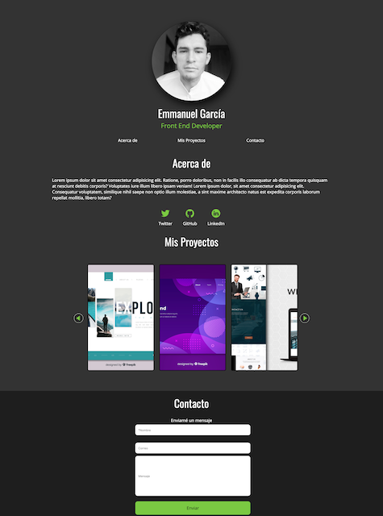
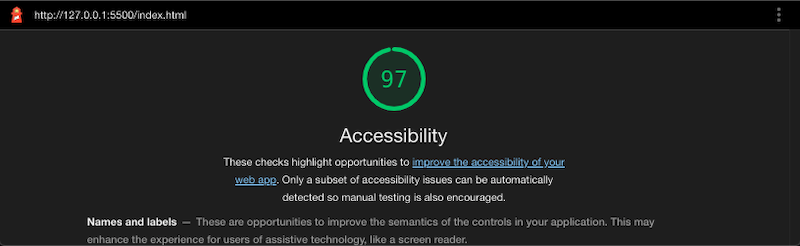

# Curso de Accesibilidad Web

En este curso, mejoraremos la accesibilidad un portafolio personal. Espero que aprendas mucho y que uses lo que aprendas aqui para implementar
prácticas accesibles en tu propio portafolio!

Usa esta URL para probar la accesibilidad con Lighthouse al principio del curso:
https://gmzjuliana.github.io/curso-acessibilidad-web/index.html

Usa esta URL para probar la accesibilidad al final:
https://gmzjuliana.github.io/curso-acessibilidad-web/final.html

- [Curso de Accesibilidad Web](#curso-de-accesibilidad-web)
  - [Preview](#preview)
  - [Intalaciones:](#intalaciones)
  - [Lenguages utilizados](#lenguages-utilizados)
  - [Conceptos](#conceptos)
    - [WCAG](#wcag)
      - [Los cuatro principios:](#los-cuatro-principios)
        - [Perceptible](#perceptible)
        - [Operable](#operable)
        - [Compresible](#compresible)
        - [Robusto](#robusto)
    - [Tecnologías Asistivas](#tecnolog%c3%adas-asistivas)
      - [Visuales](#visuales)
      - [Motoras](#motoras)
    - [ARIA](#aria)
      - [Roles](#roles)
      - [Propiedades](#propiedades)
      - [Estados](#estados)
  - [Referencias](#referencias)

## Preview

)

## Intalaciones:
[NoCoffee](https://chrome.google.com/webstore/detail/nocoffee/jjeeggmbnhckmgdhmgdckeigabjfbddl)

## Lenguages utilizados

## Conceptos
### WCAG
- **W3C** (World Wide Web Consortium)
  Creadoderes de estanderes para construir web
- **WAI** (Web Accessibility Initiative)
  Iniciativa W3C para asegurar accesibilidad web

#### Los cuatro principios:
Dentro de cada principio encontramos los criterios de conformidad que se pueden interpretar acorde al nivel de WCAG que le quieres o debes aplicar a tu sitio web. Recuerda que los 3 niveles son:

- A - nivel basico
- AA - nivel intermedio
- AAA - nivel avanzado al cual debemos apuntar si trabajamos en servicios del gobierno, universidades o servicios esenciales de la vida cotidiana.

##### Perceptible
Todo el contenido que es importante se pueda interpretar de varias maneras:
- 1 Asegurar que estamos proporcionando alternativas textuales para todo contenido no textual.
- 1.2 Proporcionar alternativas para los medios tempodependientes (como videos o audios, queremos ofrecer opciones como subtítulos o guiones).
- 1.3 Crear contenido que se pueda presentar de diferentes formas sin perder información o estructura.
- 1.4 Facilitar a los usuarios ver y oír el contenido, incluyendo la separación entre el primer plano y el fondo

##### Operable
Nuestro debe sitio es fácil de usar y navegar:
- 2.1 Proporcionar acceso a toda la funcionalidad mediante del teclado
- 2.2 Darle a las usuarias suficiente tiempo para leer y usar el contenido (tener esto en cuenta cuando hacemos time outs, comunicarlos y dar opciones para pedir más tiempo si es necesario)
- 2.3 Tener mucho cuidado de no usar elementos que brillan o se mueven muy rápido ya que pueden provocar ataques, espasmos o convulsiones
- 2.4 Asegurarnos que nuestros usuarios pueden navegar, encontrar contenido y determinar dónde se encuentran en nuestros sitios

##### Compresible
Hacer que nuestro sitio web sea comprensible nos asegura que un rango de personas lo pueden usar desde la persona que vive con una discapacidad mental que necesita patrones comunes para saber cómo usar la web hasta la persona que va de carrera y necesita consultar algo rápido

- 3.1 Tener en cuenta los tamaños de texto y contraste de colores para que los textos resulten legibles y comprensibles
- 3.2 Hacer que las páginas web aparezcan y operen de manera predecible.
- 3.3 Dar instrucciones para evitar errores y oportunidades para corregirlos cuando ocurren

##### Robusto
Cuando hacemos productos que funcionan en muchos lados, abrimos las posibilidades que cualquier persona los use sin importar su ubicación, máquina, navegador y mucho más
- 4.1 Maximizar la compatibilidad con las aplicaciones de usuario actuales y futuras, incluyendo las tecnologías asistivas

### Tecnologías Asistivas
#### Visuales
- Lectores de pantalla
  - NVS - Mozilla Firefox
  - JAWS - Explorer
  - VoiceOver - Safari
  - ChromeVox - Chrome
- Extenciones que manipulan CSS

#### Motoras
- Varilla Bucal
- Switch

### ARIA
Accesible Rich Internet Applications

#### Roles
Definen el tipo general del objeto, (como un articulo, alertas o dezlizador).
#### Propiedades
Comunican atributos que son esenciales para el comportamiento o significado de un elemento pero que se suelen comunicar visualmente.
#### Estados
Comunican estados y cambios de estado en elementos que se suelene comunicar visualemente.

## Referencias
[WCAG](http://www.sidar.org/traducciones/wcag20/es/)
[keycode](http://keycode.info/)
